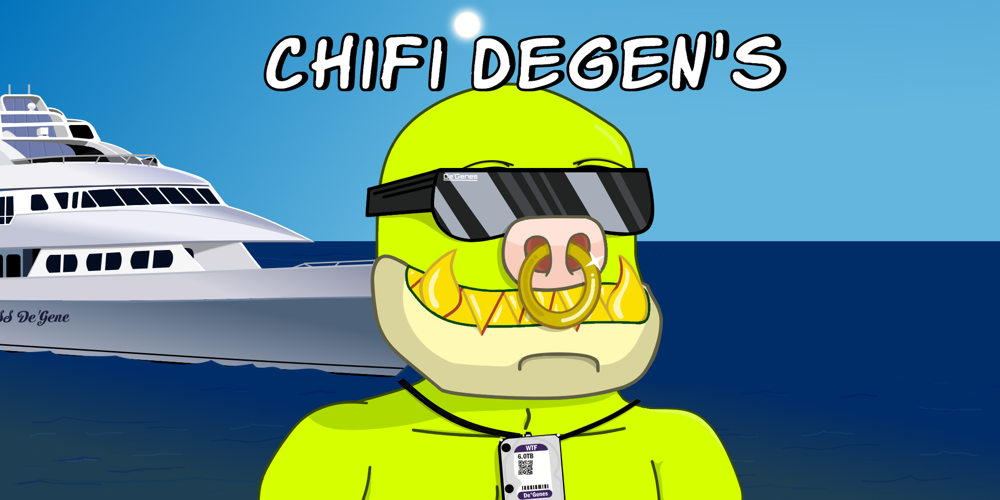
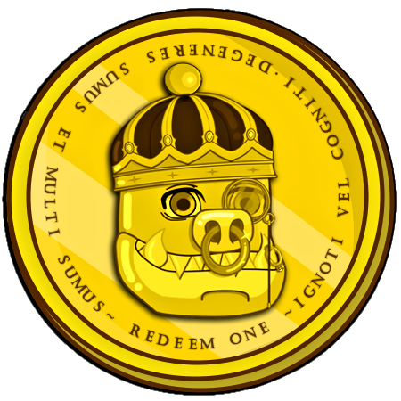

# THE DEGENPAPER

    

### Progress

    
    
    
    
    
    
     
    (Updated Daily)  Last Updated 17th Feb 2023

### About
**ChiFi Degen's** is an upcoming generative PFP NFT project on Chia, created by [SynthwaveAndy](https://twitter.com/ProofOfSynthNFT).

Let's face it, we're all a bunch of ChiFi Degen's at heart,

Some of us are `Devoted` Degens, who worship at the house of Gene. 
Some are `Tactical` Degens, waiting for the perfect opportunity to win an event or scoop a rare. 
Maybe you're a `Stealth` Degens, and don't like showing off your Degen ways in public. 
Perhaps a `Hung` Degen with your $BigD Necklace  
Or just maybe, you're a `Brazen` Degen with your gold chains, yacht and golden grills! 

No matter what kind of Degen you are, there is a ChiFi Degen for you!

### NFTokenomics:
 - Collection of **2000**.
 - Minting and Dropping in Batches of 400 every 3 Days from launch date `[TBA]`
 - 100 Unique Traits over 9 layers
 - **Rarity Rankings** will be unknowable until all 2000 have dropped.
 - **Batches** will be randomly assembled, with equal weighting of OpenRarity score.

### $DEGENomics

Asset ID: `320b869bc8d293cca8784187312da1a61cf43b9cf0724b47d8e027dcca1dd501` 

 Links: [TAIL Database](https://www.taildatabase.com/tail/320b869bc8d293cca8784187312da1a61cf43b9cf0724b47d8e027dcca1dd501)
| [SPACESCAN](https://www.spacescan.io/cat2/320b869bc8d293cca8784187312da1a61cf43b9cf0724b47d8e027dcca1dd501)

$DEGEN is a Single-Issuance Chia Asset Token (CAT) which can be used along with 0.02 XCH to redeem any ChiFi Degen on dexie for initial offer. ChiFi Degens will only be purchasable using this method for the first 12 hours after each batch drop, as such, it acts an Early Access Token. `Supply = 500`

    
    
    
    
~ Ignoti Vel Cogniti, Degeneres Sumus et Multi Sumus ~

    

#### **$DEGEN Airdrop**
On `TUE 15:00 GMT Feb 28th 2023` a snapshot will be taken of all DID's containing [Proof of Synth and Time](https://mintgarden.io/collections/proof-of-synth-and-time-col1a3stfulcehl4d4fam0w73c0mde8ws4c7k5l85fd54r45gkfhp7hswuuysv?sort_by=-created_at) or [SyntHexizer](https://mintgarden.io/collections/synthexizers-col1xmqhvls8du6zxq7ccm7jpq4xx2ds8andnjr4gfgk35w2nj23hkaqlza2p6?tab=items) NFTs. One $DEGEN will then be airdropped per NFT.

 #### **$DEGEN Bounty Program**
After the Airdrop, buy offers for all [Proof of Synth and Time](https://mintgarden.io/collections/proof-of-synth-and-time-col1a3stfulcehl4d4fam0w73c0mde8ws4c7k5l85fd54r45gkfhp7hswuuysv?sort_by=-created_at) NFTs will be uploaded to dexie.space. The offers will be 1 $DEGEN in return for each POSAT. Each POSAT traded in, will be burned.

#### Basic Info
Asset ID: `320b869bc8d293cca8784187312da1a61cf43b9cf0724b47d8e027dcca1dd501`

- [TAIL Database](https://www.taildatabase.com/tail/320b869bc8d293cca8784187312da1a61cf43b9cf0724b47d8e027dcca1dd501)

- [SPACESCAN](https://www.spacescan.io/cat2/320b869bc8d293cca8784187312da1a61cf43b9cf0724b47d8e027dcca1dd501)

### NFT Price
After the first 12 Hours, the Batches will be open for non-$DEGEN holders for `0.30 XCH standard price`

### Collaborations
The Degens will feature traits from a range of collaborators, as well as community themes and memes! These traits will reference the collaborators work, but will be hand drawn by SynthwaveAndy .

I'm still reaching out to collaborators,
The following collaborators are keen to have traits reference their project:
- [Daryl](https://twitter.com/Smith_Cypher) (Who literally inspired this entire project!)
- [ChiaSlimes](https://twitter.com/chia_slime)
- [Acevail](https://twitter.com/acevail_) ([Marvelous Marmots](https://twitter.com/MarvelMarmots), maybe [MintGarden](https://mintgarden.io/))
- [MonkeyZoo](https://twitter.com/monkeyzoo) ($MZ)
- [xchbob](https://twitter.com/xchbob) ($BigD)
- [QuirkyGiraffes](https://twitter.com/Quirky_Giraffes)
- [HexPals](https://twitter.com/HexPalsNFT)
- [Codephunk](https://twitter.com/codephunk) ([Scrawl Guys](https://twitter.com/ScrawlGuys))
- [ThiccTickers](https://twitter.com/ThiccTickers) (Church of Chia Prayer)
- [Steve Stepp](https://twitter.com/steppsr)
- [C00kies](https://twitter.com/acceptc00kies)
- ...
- More to come!
- [Proof Of Synth and Time](https://mintgarden.io/collections/proof-of-synth-and-time-col1a3stfulcehl4d4fam0w73c0mde8ws4c7k5l85fd54r45gkfhp7hswuuysv)

>*Collaborators will have the final sign-off on the trait(s) referencing their work. They reserve the right to refuse a trait design or pull their support of the project prior to launch. Further, the collaborators twitter handle will be included in the metadata of the NFT where the reference to their project appears. Thank you for supporting ChiFi Degen's :)*

If you'd like to have your project referenced because you feel it's signifgant within the community, please DM me on Twitter :)

### When!?
I will release a **Roadmap** soon with set key dates.
The best place to check on the progress is at the top of this page in the [Progress](#Progress) section.

### Final Word
Currently, if i wanted to, i could generate `1,857,945,600` **Unique** NFT's with the planned traits for **ChiFi Degen's**.
**Proof of Synth and Time** has a lot of traits, which are essentially the same but with a different Hue (color)
**ChiFi Degen's** traits will almost all be completely unique, with the exception of some of the Eyes and Hair Colors, which will share Shape, with differing colors.

All of this should indicate how diverse the collection will be, when scrolling a list and how much Time and Effort i'm putting into this.

I really feel that the Chia NFT space is missing a collection which really connects with the community.
Chia Friend's is arguably the closest in terms of historical signifigance, but i feel it doesn't hit the mark on community culture representation. We all know what we are! A Bunch of ChiFi Degen's!

Please feel free to ask me questions on Twitter or Discord (link in Twitter bio).